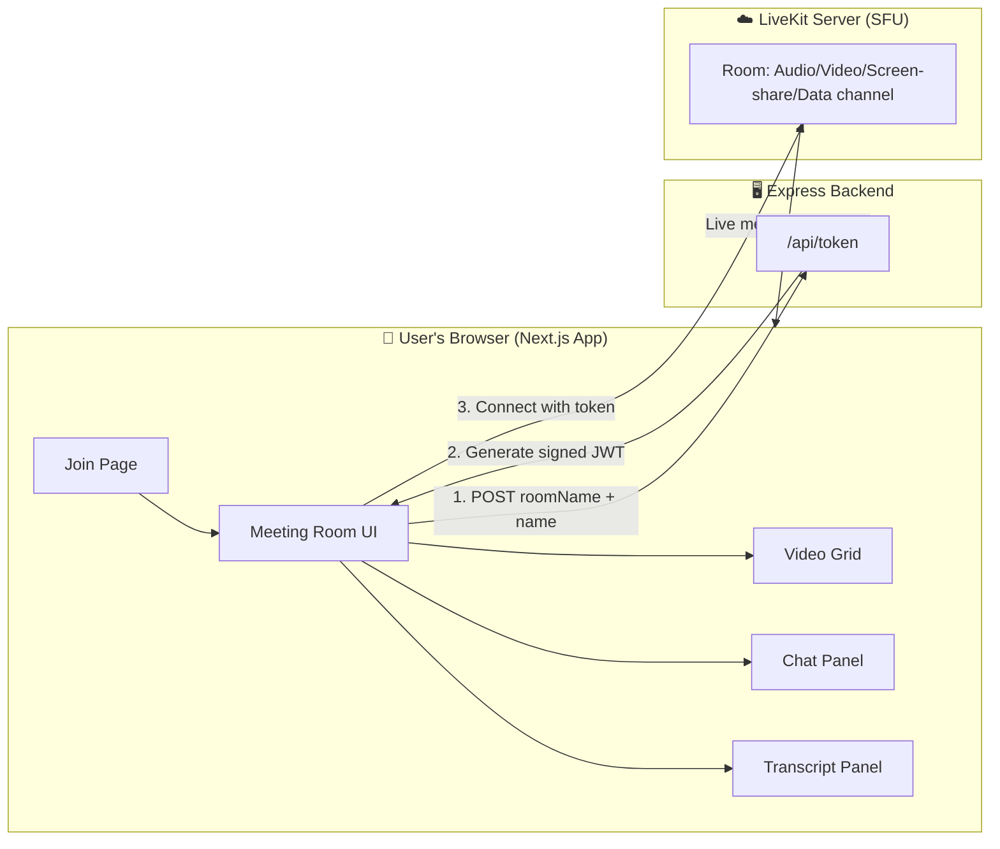

# Meeting-assistant

A real-time video meeting app — join a room, talk, share your screen, chat, and follow along with live meeting notes. Built with **Next.js** and **LiveKit**.

🔗 **Live demo:** [meeting-assistant-two-zeta.vercel.app](https://meeting-assistant-two-zeta.vercel.app)

---

## ✨ Features

-  **Video & audio rooms** — join any room by ID with camera/mic
-  **Screen sharing**
-  **Real-time chat** — sent peer-to-peer over LiveKit's data channel
-  **Participant list & count**
-  **Live transcript panel** — meeting notes feed in the sidebar
  > Currently shows a **simulated** transcript (sample phrases on a timer) as a UI placeholder for a future real speech-to-text integration — it isn't transcribing real audio yet.
-  Smooth animated UI (GSAP + Tailwind CSS)

---

## 🧱 Tech Stack

| Layer | Technology |
|---|---|
| Frontend | Next.js 16, React 19, TypeScript, Tailwind CSS, Zustand, GSAP |
| Real-time media | LiveKit (`livekit-client`, `@livekit/components-react`) |
| Backend | Node.js, Express |
| Auth/Signaling | `livekit-server-sdk` (issues room access tokens) |
| Hosting | Vercel (frontend), Node host of your choice (backend) |

---

## 🏗️ System Architecture

**In one line:** the Next.js frontend talks to a tiny Express backend just to get a signed token, then connects *directly* to LiveKit's media servers for all actual audio/video/chat — the backend never touches the call itself.



### How it works, step by step
1. **Join** — user enters a room ID and their name on `/join`.
2. **Token request** — the frontend asks the Express backend for a token: `POST /api/token { roomName, participantName }`.
3. **Token issuance** — the backend uses `livekit-server-sdk` (with your `LIVEKIT_API_KEY`/`LIVEKIT_API_SECRET`) to sign a short-lived JWT granting that user access to that specific room.
4. **Connect** — the frontend uses that token to connect *directly* to the LiveKit server. From here, audio, video, screen share, and chat messages flow peer-to-peer through LiveKit — **not** through the Express backend.
5. **Render** — `MeetingRoom` renders the video grid, chat panel, and transcript panel using LiveKit's React hooks/components.

> 💡 The backend's *only* job is issuing tokens. This keeps it lightweight and means it can be hosted anywhere cheap (it doesn't need to handle media traffic).

---

## 📂 Project Structure

```
Meeting-assistant/
├── backend/
│   ├── index.js              # Express app entry point
│   ├── routes/
│   │   └── token.js          # Issues LiveKit room access tokens
│   └── package.json
│
└── frontend/
    ├── app/
    │   ├── page.tsx           # Landing page
    │   ├── join/page.tsx      # Room ID + name entry
    │   └── meeting/[roomId]/  # Token fetch + meeting room
    ├── src/components/meeting/
    │   ├── MeetingRoom.tsx     # LiveKit room wrapper
    │   ├── VideoGrid.tsx       # Camera + screen-share tiles
    │   ├── ControlsBar.tsx     # Mute/camera/screen-share controls
    │   ├── ChatPanel.tsx       # Real-time chat (LiveKit data channel)
    │   ├── TranscriptPanel.tsx # Live notes feed
    │   └── ParticipantSidebar.tsx
    └── package.json
```

---

## 🚀 Getting Started

### Prerequisites
- Node.js 18+
- A free [LiveKit Cloud](https://livekit.io) project (or a self-hosted LiveKit server) — you'll need its **URL**, **API Key**, and **API Secret**

### 1. Backend
```bash
cd backend
npm install
```
Create `backend/.env`:
```env
PORT=5000
LIVEKIT_API_KEY=your_livekit_api_key
LIVEKIT_API_SECRET=your_livekit_api_secret
```
```bash
npm run dev
```

### 2. Frontend
```bash
cd frontend
npm install
```
Create `frontend/.env.local`:
```env
NEXT_PUBLIC_BACKEND_URL=http://localhost:5000
NEXT_PUBLIC_LIVEKIT_URL=wss://your-project.livekit.cloud
```
```bash
npm run dev
```

Open [http://localhost:3000](http://localhost:3000) → click **Join** → enter a room ID and name 🎉

---


## Support
Consider giving a star if you find this repository helpful
